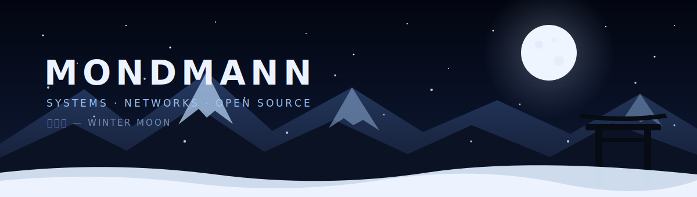

  

  

  <i>静かな冬の夜に、長く残るものをつくる。</i> 
  Building things meant to last, under a quiet winter moon.

 

## 月下 — About

I am **mondmann**, a student developer focused on systems programming, reliable networks, privacy-respecting software, and open source.

I prefer understanding how things work beneath the surface: memory, protocols, data structures, operating systems, and the decisions that make software dependable.

- Building **Lantern**, a resilient messenger designed for unreliable or unavailable internet connections
- Learning **Rust** for safe systems and network programming
- Practising algorithms and competitive programming in **C++**
- Using **Arch Linux** as my main development environment
- Interested in networking, distributed systems, privacy, security, and developer tooling

 

## 今 — Current direction

<table>
<tr>
<td width="50%" valign="top">
<h3>Lantern</h3>

A privacy-respecting communication project focused on resilience, offline-first behaviour, local networking, and careful protocol design.

<code>Rust</code> <code>Networking</code> <code>Cryptography concepts</code> <code>SQLite</code>

<b>Status:</b> architecture and core development

</td>
<td width="50%" valign="top">
<h3>Competitive programming</h3>

Building strong foundations in algorithms, data structures, problem solving, correctness, and efficient implementation.

<code>C++</code> <code>Algorithms</code> <code>Data structures</code> <code>Math</code>

<b>Focus:</b> olympiad-level problem solving

</td>
</tr>
</table>

 

## 技術 — Toolkit

  

<table align="center">
<tr>
<td><b>Languages</b></td>
<td>Rust · C++ · Python · Bash</td>
</tr>
<tr>
<td><b>Environment</b></td>
<td>Arch Linux · Git · GitHub · VS Code</td>
</tr>
<tr>
<td><b>Studying</b></td>
<td>Networking · Tokio · SQLite · Testing · Fuzzing · Cryptography concepts</td>
</tr>
<tr>
<td><b>Principles</b></td>
<td>Correctness · Simplicity · Privacy · Reliability · Open source</td>
</tr>
</table>

 

## 雪跡 — Contribution trail

  <picture>
    <source media="(prefers-color-scheme: dark)" srcset="./assets/github-snake-dark.svg" />
    <source media="(prefers-color-scheme: light)" srcset="./assets/github-snake-light.svg" />
    
  </picture>

<b>GitHub overview</b>

 

  

 

<h3>冬の月</h3>
Quiet code. Clear thought. Reliable systems.
  

